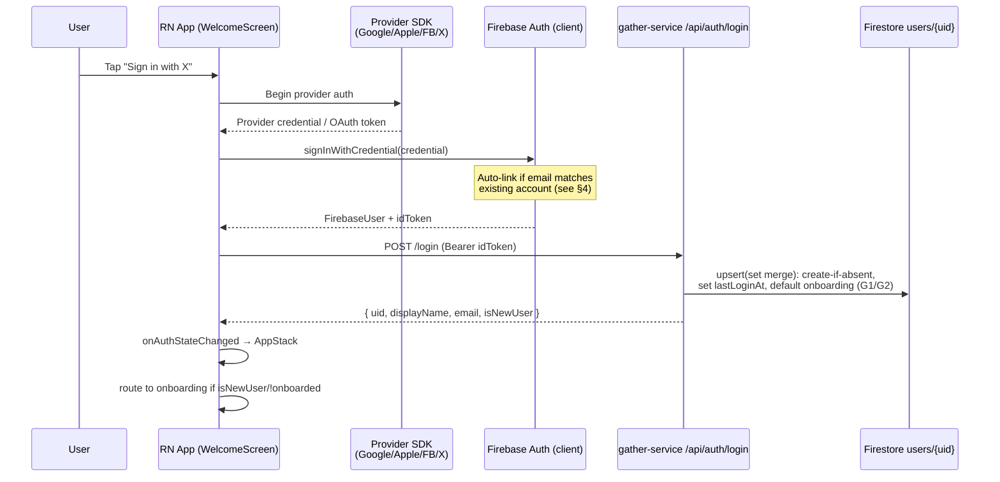

# Social Sign-In — Implementation Plan

**Status:** In progress · **Date:** 2026-06-07 · **Owner:** @wcharlesknight
**Feature:** Add Google, Apple, Facebook, Twitter/X sign-in to Gatherus (LoopIn app), alongside existing email/password.

### Progress log
- ✅ **Phase 0 (backend):** `AuthService.login()` now upserts the Firestore profile (G1) with provider + onboarding defaults (G2); `AuthResponse.isNewUser` added (G4). Unit tests added & passing.
- ✅ **Phase 1 (Google, code):** installed `@react-native-google-signin/google-signin`; added `api/socialAuth.ts`, `components/SocialButton.tsx`, `constants/auth.ts`; wired the provider button column into `WelcomeScreen`. `tsc` + ESLint clean.
- ⏳ **Blocked on manual setup** before Google can run end-to-end — see "Required manual setup" below.
- ⬜ Phase 2 Apple · ⬜ Phase 3 Facebook 🔒 · ⬜ Phase 4 Twitter 🔒

### Required manual setup (before testing Google)
1. **Firebase console** → Authentication → Sign-in method → enable **Google**.
2. Re-download **`GoogleService-Info.plist`** (now contains `CLIENT_ID`/`REVERSED_CLIENT_ID`) into `ios/`, and add **`google-services.json`** to `android/app/` (G3).
3. Paste the **Web client ID** into `constants/auth.ts` (`GOOGLE_WEB_CLIENT_ID`).
4. **iOS:** add the `REVERSED_CLIENT_ID` as a URL scheme in `Info.plist`; run `cd ios && pod install`.
5. **Android:** register your **debug keystore SHA-1** in Firebase; ensure the Google Services Gradle plugin is applied.

---

## 1. Goals & Scope

| | |
|---|---|
| **Primary goal** | One-tap social sign-up/sign-in to reduce signup friction. Google is the priority. |
| **In scope** | Google, Apple, Facebook, Twitter/X. Email/password already exists. |
| **Account linking** | **Auto-link by verified email** — one Gatherus account per person, multiple providers attached. |
| **Tabled (not now)** | **Phone (SMS OTP)** — deferred per decision (avoids SMS billing for now). |
| **Out of scope (for now)** | Account-management UI to unlink providers, multi-factor auth, web client. |

> **Prerequisite gating (as of 2026-06-07):** Only the **Apple Developer Program** is set up. **Facebook** needs a Meta developer app and **Twitter/X** needs an X developer app — neither exists yet, and Meta app review can take days. So **Google + Apple are buildable immediately; Facebook + Twitter are blocked** until those external accounts are created. There is also **no production Android keystore yet**, so release-build Google Sign-In on Android is deferred (debug SHA works for development).

**Why Apple is included (it wasn't in the mockup):** App Store Review Guideline **4.8** requires offering *Sign in with Apple* on iOS whenever you offer a competing third-party login (Google/Facebook/Twitter). Shipping the others without Apple risks iOS rejection.

---

## 2. Current State (as built)

**Frontend — `LoopIn` (React Native 0.79, `@react-native-firebase` v23):**
- `screens/WelcomeScreen.tsx` — email/password only; calls Firebase client SDK then `syncLogin(idToken)`.
- `api/auth.ts` — `registerUser()` → `POST /api/auth/register`; `syncLogin()` → `POST /api/auth/login`.
- `navigation/RootNavigator.tsx` — `onAuthStateChanged` switches `AuthStack` ⇄ `AppStack`.
- `navigation/AppStack.tsx` — routes to `LocationPicker` when `!userProfile.location || !userProfile.hasCompletedOnboarding`.

**Backend — `gather-service` (Spring Boot + Firebase Admin SDK):**
- `POST /api/auth/register` — creates Firebase user, writes Firestore `users/{uid}` doc (`displayName, email, createdAt, lastLoginAt, hasCompletedOnboarding=false`), returns `customToken`.
- `POST /api/auth/login` — verifies Bearer `idToken`, **`.update()`s** `lastLoginAt` on `users/{uid}`, returns `{uid, displayName, email}`.
- `FirebaseAuthenticationFilter` — verifies Bearer idToken on all routes.

### ⚠️ Critical gaps found in current code

| # | Gap | Impact | Fix location |
|---|-----|--------|--------------|
| **G1** | `AuthService.login()` uses Firestore `.update()`, which **throws if the doc is absent**. Social first-timers never went through `register`, so they have **no `users/{uid}` doc** → first login 500s. | **Blocks every social sign-up.** | `gather-service` |
| **G2** | `hasCompletedOnboarding` is only set during email `register`. Social users would have it undefined → onboarding routing ambiguous. | Wrong post-login screen. | `gather-service` |
| **G3** | Android is **missing `android/app/google-services.json`**. Firebase Google Sign-In can't work on Android without it. | Android build/auth fails. | `LoopIn` native config |
| **G4** | `AuthResponse` has no "is new user" flag; client can't tell first social login from returning. | Minor UX (can't branch to onboarding from response). | `gather-service` DTO |

---

## 3. Target Architecture

All providers converge on a **single Firebase credential flow**, so the app and backend stay provider-agnostic after the credential is obtained.



**Key principle:** the backend only ever sees a verified Firebase `idToken` — it does **not** integrate with Google/Facebook/etc. directly. Provider complexity lives entirely in the client SDKs + Firebase. This means **the only backend change is making `/login` idempotent for new users (G1/G2/G4).**

---

## 4. Account Linking Strategy — Auto-link by Email

Firebase enforces "one account per email" only if **"link accounts that use the same email"** is enabled in the Firebase console (Authentication → Settings → User account linking). With it on:

- Same verified email across providers → same `uid`.
- A provider returning an **unverified** email, or a collision Firebase won't auto-merge, throws `auth/account-exists-with-different-credential`.

**Client handling for that error:**
1. Read `error.email` from the exception.
2. `auth().fetchSignInMethodsForEmail(email)` → which provider they originally used.
3. Prompt: *"You already signed in with {Google}. Sign in with that to continue."*
4. After they re-auth with the original provider, call `currentUser.linkWithCredential(pendingCredential)` to attach the new provider.

This is a finite, well-known state machine — captured as a dedicated helper (`linkPendingCredential`) so every provider button reuses it.

---

## 5. Backend Changes (`gather-service`)

> Per CLAUDE.md guardrail: these are the **only** server changes; verify against the live DTOs before coding.

1. **Fix `AuthService.login()` to upsert (G1/G2).** Replace the `.update(lastLoginAt)` with a create-or-merge:
   - If `users/{uid}` doc is **absent**: `set()` a new doc from the decoded token (`displayName` ← `name` claim, `email`, `createdAt`, `lastLoginAt`, `hasCompletedOnboarding=false`, `provider` ← sign-in provider from token's `firebase.sign_in_provider`). Mark `isNewUser=true`.
   - If present: `set(..., merge)` just `lastLoginAt`. `isNewUser=false`.
   - Use `FirestoreAwait.get(... .set(map, SetOptions.merge()))`.
2. **Add `isNewUser` (and optionally `hasCompletedOnboarding`) to `AuthResponse`** (G4) so the client can route to onboarding directly from the login response without waiting for the profile listener.
3. **No new endpoint needed.** Social sign-up reuses `/login`. (`/register` stays email-only.)
4. **Tests:** add `AuthService.login()` cases — (a) new social user with no doc → doc created, `isNewUser=true`; (b) returning user → only `lastLoginAt` touched.

---

## 6. Frontend Changes (`LoopIn`)

### 6.1 Dependencies & native setup (prereqs — do first)

| Provider | Library | Native config required |
|---|---|---|
| Google | `@react-native-google-signin/google-signin` | iOS: reversed client ID URL scheme in `Info.plist` (from `GoogleService-Info.plist`). **Android: add `google-services.json` (G3) + SHA-1/SHA-256 fingerprints in Firebase.** Enable Google in Firebase console. |
| Apple | `@invertase/react-native-apple-authentication` | iOS only: enable "Sign in with Apple" capability in Xcode + Apple Developer. Enable Apple provider in Firebase. |
| Facebook 🔒 | `react-native-fbsdk-next` | **Blocked: needs Meta developer app.** Then `Info.plist` (`FacebookAppID`, URL scheme) + Android `strings.xml`/manifest. Enable Facebook in Firebase. |
| Twitter/X 🔒 | Firebase OAuth provider (`auth.TwitterAuthProvider`, no extra SDK) | **Blocked: needs X developer app** + keys in Firebase console. Uses Firebase web OAuth flow. |

🔒 = external developer account not yet created (see §1 gating note).

### 6.2 New module: `api/socialAuth.ts` (provider → Firebase credential)

A function per provider, each returning a `FirebaseAuthTypes.AuthCredential`, plus a shared `signInWithProvider()` that: gets credential → `signInWithCredential` → handles `account-exists-with-different-credential` via `linkPendingCredential` (§4) → returns the `FirebaseUser`. Keeps `WelcomeScreen` thin.

### 6.3 `screens/WelcomeScreen.tsx` refactor

- Add a provider-button column to the existing auth view (matching the mockup: Google card, then colored Facebook/Twitter/Phone, with email + Apple).
- Each button calls `signInWithProvider(kind)` → on success `syncLogin(idToken)` (existing) → routing handled by `onAuthStateChanged` + `isNewUser`.
- Reuse existing loading/error patterns; centralize provider error messages.

### 6.4 New component: `components/SocialButton.tsx`

Reusable button (icon + label + brand color) to keep `WelcomeScreen` declarative and consistent with the mockup styling.

---

## 7. Data Model Impact (Firestore `users/{uid}`)

Add one field; backward compatible.

| Field | Type | Notes |
|---|---|---|
| `provider` | string | `password` / `google.com` / `apple.com` / `facebook.com` / `twitter.com`. From token `firebase.sign_in_provider`. |
| `email` | string \| null | Most providers return email, but **Twitter/X may not** — handle null in profile/UI. |
| `displayName` | string \| null | Apple only returns name on *first* auth; capture it then or fall back to "Member". |

No schema migration (Firestore is schemaless); existing email users keep working.

---

## 8. Security & Privacy Considerations

- **Token verification unchanged** — backend still trusts only `verifyIdToken(idToken, true)` (checkRevoked). Provider trust is delegated to Firebase. ✅ No new attack surface server-side.
- **Email-collision hijack:** only auto-link on **verified** emails (Firebase enforces); never link on unverified email — that's why `account-exists-with-different-credential` must be handled, not suppressed.
- **Apple private relay emails** (`@privaterelay.appleid.com`) are valid — don't reject them.
- **Secrets:** Facebook App Secret / X API keys live in **Firebase console**, not in the app bundle. `GoogleService-Info.plist` / `google-services.json` are not secrets but should still not be committed if the repo is public (check `.gitignore`).
- **Twitter/X email:** X often does **not** return an email, which weakens auto-linking by email for those users — they may end up as a separate account. Acceptable given X is a later phase.

---

## 9. Testing Plan

| Layer | Tests |
|---|---|
| Backend unit | `AuthService.login()`: new-user upsert creates doc + `isNewUser=true`; returning user only updates `lastLoginAt`; invalid token → `InvalidTokenException`. |
| Frontend unit | `socialAuth` helpers mocked: success path, `account-exists-with-different-credential` → link path, user-cancel path. |
| Manual / device | Each provider end-to-end on **iOS + Android real devices** (simulators can't do Google/Apple reliably). New user → onboarding; returning user → Home; cross-provider same email → single account. |
| Regression | Existing email/password sign-up + sign-in still work; `/login` still records `lastLoginAt` for existing users. |

---

## 10. Task Breakdown & Sequencing

> Suggested order. Backend G1 fix unblocks *all* social testing, so do it early.

**Phase 0 — Foundations**
1. Backend: `AuthService.login()` upsert + `isNewUser` on `AuthResponse` (G1/G2/G4) + tests.
2. Add Android `google-services.json` (G3); confirm iOS reversed-client-ID URL scheme.
3. Frontend scaffolding: `api/socialAuth.ts`, `components/SocialButton.tsx`, error-message map.

**Phase 1 — Google (priority)**
4. Install `@react-native-google-signin/google-signin`; enable Google in Firebase; SHA fingerprints.
5. Implement Google credential + wire button in `WelcomeScreen`; test new+returning on both platforms.

**Phase 2 — Apple (iOS App Store requirement; account is ready)**
6. Install Apple auth lib; Xcode capability; implement + test (incl. private-relay email, name-only-on-first-auth).

**Phase 3 — Facebook 🔒 (blocked until Meta developer app exists)**
7. Create Meta app → Facebook SDK + native config; implement + test.

**Phase 4 — Twitter/X 🔒 (blocked until X developer app exists)**
8. Create X app → Twitter/X via Firebase OAuth provider; implement + test.

**Phase 5 — Hardening**
9. Account-linking edge cases; analytics/event logging; final regression pass.

> **Immediately actionable now:** Phases 0 → 1 (Google) → 2 (Apple). Phases 3–4 unblock once you create the Meta and X developer apps.

---

## 11. Decisions & Remaining Risks

**Decided (2026-06-07):**
- ✅ Phone sign-in **tabled** (no SMS billing for now).
- ✅ Apple Developer Program **ready**; Meta + X developer apps **not created yet** → Facebook/Twitter deferred to Phases 3–4.
- ✅ No production Android keystore yet → release-build Android Google Sign-In deferred; develop against debug SHA.
- ✅ Rollout: build **Google → Apple** first (satisfies App Store 4.8), Facebook/Twitter as follow-ups.

**Remaining risks / to confirm:**
1. **Android dev SHA-1:** need the **debug** keystore SHA-1 registered in Firebase to test Google Sign-In on Android now (separate from the missing production keystore).
2. **`.gitignore`:** Should Firebase native config (`GoogleService-Info.plist`, incoming `google-services.json`) be committed? iOS plist is currently in the repo — fine for a private repo, reconsider if public.
3. **Twitter/X email gap:** X users without email won't auto-link by email (§8) — accepted for the later phase.
```
